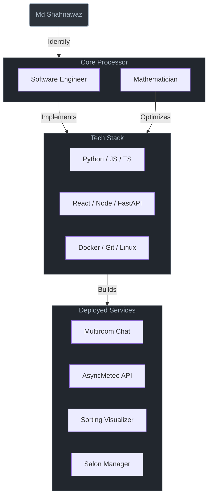

# System Architecture: Md Shahnawaz

## 🟢 Deployed Services

| Service ID | Tech Specification | Description |
| :--- | :--- | :--- |
| **[socketio-multiroom-chat](https://github.com/infinawaz/socketio-multiroom-chat)** | `Node.js` `Socket.io` | Real-time messaging architecture with dynamic room allocation. |
| **[AsyncMeteo](https://github.com/infinawaz/AsyncMeteo)** | `FastAPI` `Python` | Asynchronous high-throughput weather forecasting interface. |
| **[Ultimate Sorting Visualizer](https://github.com/infinawaz/ultimate-sorting-visualizer)** | `React` `Algorithms` | Frontend visualization engine for complex sorting algorithms. |
| **[Salon City](https://github.com/infinawaz/hair_salon)** | `Full Stack` `MVC` | Enterprise-grade management system for beauty service providers. |

## 📡 Communication Uplink

- **Direct Line**: [shahanwazdgp07@gmail.com](mailto:shahanwazdgp07@gmail.com)
- **Network**: [LinkedIn Profile](https://linkedin.com/in/md-shahnawaz-alam-khan-7b2121179/)
- **Source**: [GitHub Profile](https://github.com/infinawaz)

---
*System Monitor v3.0 // End of Log*
