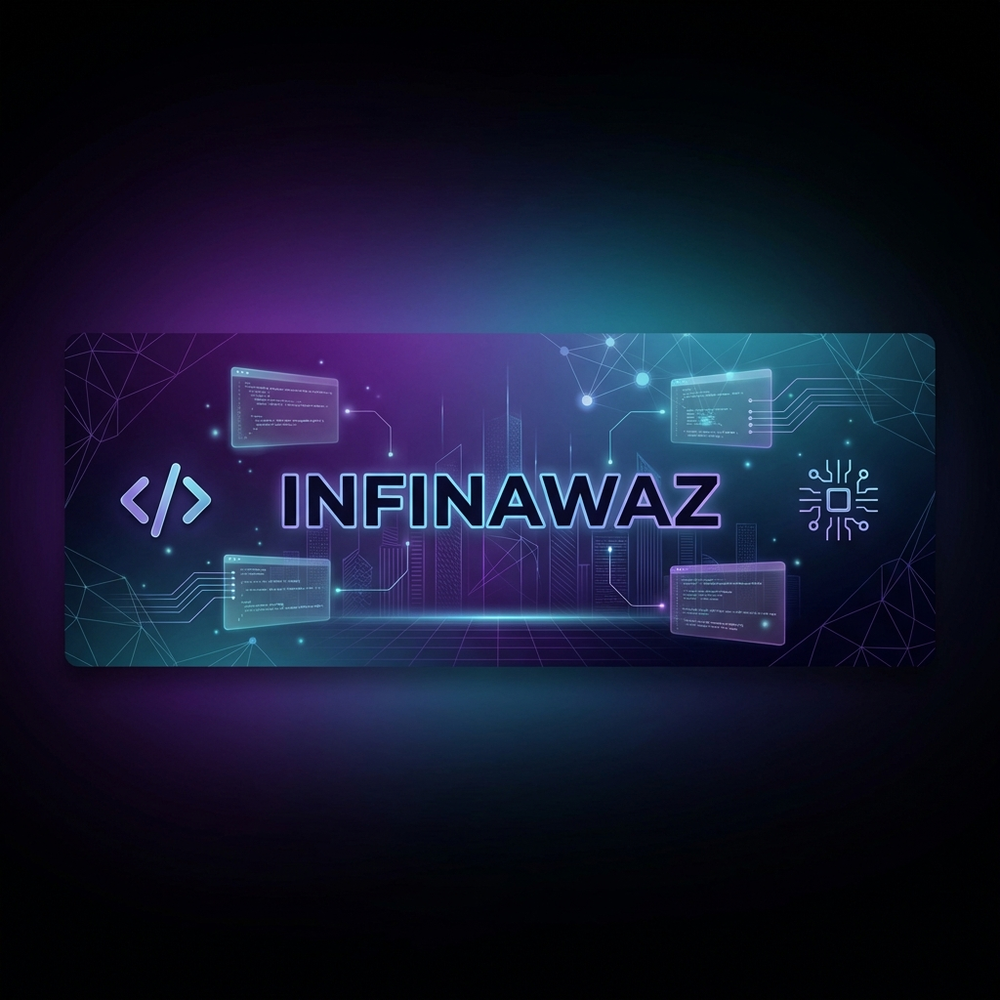

<div align="center">

<!-- HEADER BANNER -->


<!-- ANIMATED TYPING -->
<a href="https://git.io/typing-svg"></a>

<br/>

<!-- SOCIAL BADGES -->
[](https://linkedin.com/in/md-shahnawaz-alam-khan-7b2121179/)
[](mailto:shahanwazdgp07@gmail.com)
[](https://github.com/infinawaz)
[](#)

</div>

---


##  About Me

```javascript
const infinawaz = {
    name: "Md Shahnawaz",
    role: "Software Engineer",
    code: ["Python", "TypeScript", "JavaScript", "SQL"],
    askMeAbout: ["web dev", "algorithms", "system design"],
    technologies: {
        frontEnd: ["React", "Next.js", "HTML", "CSS"],
        backEnd: ["FastAPI", "Node.js", "Express"],
        databases: ["PostgreSQL", "SQLite", "MongoDB"],
        devOps: ["Docker", "Git", "Linux", "Vercel"]
    },
    currentFocus: "Building scalable web applications",
    funFact: "I debug with console.log and I'm proud of it 😄"
};
```

<br clear="both"/>

---

##  Tech Stack

<div align="center">

### Languages


### Frameworks & Libraries


### Tools & Infrastructure


</div>

---

##  Featured Projects

<div align="center">

<a href="https://github.com/infinawaz/socketio-multiroom-chat">
  
</a>
<a href="https://github.com/infinawaz/AsyncMeteo">
  
</a>
<a href="https://github.com/infinawaz/ultimate-sorting-visualizer">
  
</a>
<a href="https://github.com/infinawaz/errfriendly">
  
</a>

</div>

---

##  GitHub Analytics

<div align="center">
  
  
</div>

<div align="center">
  
</div>

---

## 🏆 GitHub Trophies

<div align="center">
  
</div>

---

<div align="center">

### 🐍 Contribution Snake

<picture>
  <source media="(prefers-color-scheme: dark)" srcset="https://raw.githubusercontent.com/infinawaz/infinawaz/output/github-snake-dark.svg" />
  <source media="(prefers-color-scheme: light)" srcset="https://raw.githubusercontent.com/infinawaz/infinawaz/output/github-snake.svg" />
  
</picture>

</div>

---

<div align="center">

### 💭 Random Dev Quote


</div>

---

<div align="center">


### Let's Connect! 🤝

<i>I'm always open to collaborating on interesting projects and innovative ideas.</i>

[](https://linkedin.com/in/md-shahnawaz-alam-khan-7b2121179/)
[](mailto:shahanwazdgp07@gmail.com)

---


</div>
